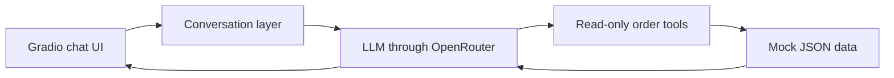

# Order Support Chatbot — Demo Scope

## 1. Purpose

This demo shows how a conversational assistant can help a customer understand orders they have already placed.

The focus is a small but convincing read-only experience. A customer can ask questions naturally, identify orders by product rather than order number, and continue with follow-up questions without repeatedly supplying the same information.

The demo is intended to validate the user experience and illustrate how an LLM can work with deterministic business data. It is not a production customer-support system.

## 2. Core experience

A presenter selects one of three fictional customers and starts a chat. The assistant can then:

- List the selected customer’s orders.
- Find the latest or previous order.
- Find an order by product name, category, or stored product attribute.
- Explain what was ordered and in what quantity.
- Show order totals.
- Report processing, shipment, delivery, and delay status.
- Provide estimated delivery dates, courier names, tracking numbers, and latest updates.
- Answer simple product questions using attributes stored with the ordered item.
- Understand follow-ups such as “When will that arrive?” or “What else was in it?”
- Ask for clarification when the intended order is uncertain.

The assistant is conversational, but all customer-specific facts must come from the mock order data.

## 3. Supported question types

### Order discovery

- “What orders have I placed?”
- “What is my latest order?”
- “What did I order in July?”
- “Which of my orders have been delivered?”
- “Which order was the most expensive?”

### Product-based lookup

- “Which order contains the headphones?”
- “When did I order the 750 ml bottle?”
- “Did I buy anything with 128 GB of storage?”
- “Which order contains my UK size 6 shoes?”

### Order details

- “What was in that order?”
- “How many did I order?”
- “What color or size did I choose?”
- “How much did the complete order cost?”

### Delivery information

- “Where is my order?”
- “Has it shipped?”
- “When should it arrive?”
- “Which courier is delivering it?”
- “What is the tracking number?”
- “Why is it delayed?”
- “Has the entire order shipped?”

## 4. Conversational behavior

The assistant receives recent chat history and an explicit `active_order_id` so that the customer can move from a broad question to increasingly specific follow-ups. When a response identifies exactly one valid order, that order becomes active for the next turn. Changing the selected customer clears this state.

For example:

> **Customer:** What orders have I placed?  
> **Assistant:** You have three recent orders...  
> **Customer:** Which one contains the headphones?  
> **Assistant:** The headphones are in ORD-1042.  
> **Customer:** Where are they now?  
> **Assistant:** They have shipped and are currently in transit...  
> **Customer:** What color did I choose?

The assistant should interpret references such as “it,” “they,” “that order,” “the older one,” and “my previous order” from the conversation. When more than one interpretation is reasonable, it should ask a focused clarification question rather than guess.

## 5. Demonstration customers and scenarios

The application contains three fictional customer profiles and nine orders.

### Aarav Sharma

Useful for demonstrating:

- Finding an order containing headphones.
- Tracking an active shipment.
- Looking up color, connectivity, warranty, courier, and delivery date.
- Moving between a current order and an earlier delivered order.
- Looking up a backpack or bottle by product attributes.

### Meera Iyer

Useful for demonstrating:

- Finding and explaining a delayed order.
- Showing a revised delivery date and reason for delay.
- Inspecting an order containing multiple products.
- Confirming the quantity, size, and color of running shoes.
- Looking up product details for a cookware set.

### Kabir Khan

Useful for demonstrating:

- Finding an order that is out for delivery today.
- Inspecting tablet storage and matching accessory details.
- Explaining a partially shipped order.
- Distinguishing what has shipped from what is still being prepared.
- Finding an older order containing two identical jackets.

## 6. Recommended demo flows

### Primary flow: natural follow-ups

Select **Aarav Sharma**:

1. “What orders have I placed?”
2. “Which one contains the headphones?”
3. “Where are they now?”
4. “When should they arrive?”
5. “What color did I choose?”
6. “What is the tracking number?”

### Delayed-order flow

Select **Meera Iyer**:

1. “Are any of my orders delayed?”
2. “What caused the delay?”
3. “What else is included in that order?”
4. “What is the revised delivery date?”
5. “How many notebooks are in the set?”

### Split-shipment flow

Select **Kabir Khan**:

1. “Which order contains my desk lamp?”
2. “Has the entire order shipped?”
3. “What has shipped already?”
4. “What is still being prepared?”
5. “When is the order expected?”

### Customer-isolation check

Select **Aarav Sharma** and ask:

> “Tell me about order ORD-1107.”

ORD-1107 belongs to another customer. The chatbot should not reveal its contents. Customer isolation is enforced in Python rather than relying only on model instructions.

### Scope-boundary check

Ask about an order and then request a change:

1. “Where are my headphones?”
2. “Can you cancel them?”

The assistant should explain that this demo is read-only and must not claim to have changed the order.

## 7. System design

The demo consists of four small components:



### Chat interface

The Gradio UI provides:

- A fictional customer selector.
- A chat history panel.
- A text input for natural-language questions.
- Suggested questions for the presenter.
- A clear indication that the data is fictional and the demo is read-only.

Changing the selected customer clears the current conversation.

### Mock data

Customer and order data is stored in a local JSON file. It contains customers, orders, line items, product attributes, totals, shipment status, tracking details, and delivery estimates.

No external order-management or courier system is contacted.

### Order tools

The model has access to three deterministic Python functions:

- List orders belonging to the selected customer.
- Retrieve the full details of one order.
- Find orders containing a product or attribute.

The selected customer is supplied by the application and cannot be changed by the model. This prevents a lookup from returning another fictional customer’s orders.

### Language model

The application sends requests to OpenRouter using a model configured in `.env`. The default demonstration model is GPT-5.6 Luna, selected for a lightweight, cost-conscious tool-calling workflow.

The LLM is responsible for understanding the question, choosing an appropriate lookup, interpreting the returned facts, and producing a concise customer-friendly response. It is not the source of order facts.

## 8. Configuration and operation

The project uses Python 3.12 and `uv` for its environment and dependency management.

An OpenRouter API key must be added to the local `.env` file:

```dotenv
OPENROUTER_API_KEY=your_openrouter_key
OPENROUTER_MODEL=openai/gpt-5.6-luna
OPENROUTER_BASE_URL=https://openrouter.ai/api/v1
```

The application is started with:

```bash
uv run python app.py
```

The `.env` file is excluded from Git. `.env.example` documents the required configuration without containing a real credential.

## 9. Out of scope

The demo does not support:

- Payments or payment problems.
- Cancellations or cancellation-status tracking.
- Refunds.
- Returns or exchanges.
- Address changes.
- Delivery rescheduling.
- Invoice generation.
- Support-ticket creation.
- Policy-document retrieval.
- Real authentication or authorization.
- Connections to production systems.
- Changes to the mock order data.

When asked to perform an unsupported action, the assistant should identify the limitation plainly rather than simulate success.

## 10. Known limitations

- General conversation context is based on a limited number of recent chat messages; the currently discussed order is preserved separately as structured session state.
- The quality of reference resolution and clarification depends partly on the selected model.
- Dates in the mock data are fixed around the demonstration date.
- Product search operates on simple text matching in stored names, categories, and attributes.
- The OpenRouter request requires network connectivity and available model credits.
- The UI is intended for local demonstration rather than deployment or concurrent public use.

## 11. Success criteria

The demo is successful if it reliably shows that:

- Customers can find orders without knowing an order number.
- Responses accurately reflect the mock order data.
- Follow-up questions preserve the subject of the conversation.
- Ambiguous questions result in useful clarification.
- Delivery and product details are explained naturally.
- Another customer’s order cannot be accessed through the chat.
- Unsupported actions are declined without invented results.
- The complete application can be set up and run locally with a small number of commands.
