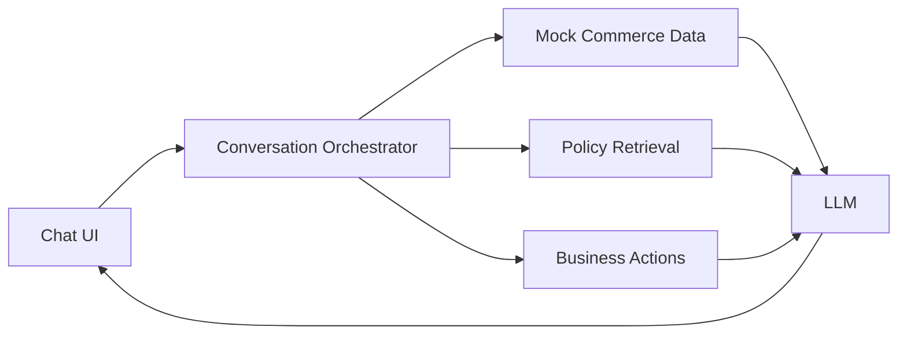

# Order Support Chatbot POC — Project Scope

## 1. Purpose

Build a small proof of concept showing how a conversational assistant could help customers with orders they have already placed.

The POC should demonstrate a noticeably better experience than a traditional scripted chatbot: customers should be able to use natural language, ask follow-up questions, change topics, refer to an order or product indirectly, and complete selected support tasks without repeating information.

The purpose is to validate the experience and technical approach. It is not intended to be production-ready or connected to real company systems.

## 2. What the POC should demonstrate

The finished POC should show that an assistant can:

- Identify the customer and the relevant order or item.
- Answer questions using structured order, shipment, payment, and product data.
- Consult relevant company policies without loading every policy into the model context.
- Maintain context across a multi-step, multi-topic conversation.
- Distinguish between answering a question and performing an action.
- Check whether an action is allowed before offering or performing it.
- Ask for confirmation before consequential actions.
- Explain why an action is unavailable and offer a sensible alternative.
- Create or update mock records so that changes persist during the demonstration.
- Escalate unsupported or exceptional cases to a mock support ticket.

The five scripts in [`sample_conversations`](sample_conversations/) illustrate the intended experience.

## 3. Candidate customer journeys

The broader POC may support the following journeys. They do not all need equal depth.

### Order information

- List recent orders.
- Show the contents, quantities, prices, and payment method for an order.
- Answer product questions using the attributes of the product that was ordered.
- Generate or retrieve an invoice.

### Shipment and delivery

- Show shipment status, tracking information, and estimated delivery date.
- Explain delays or split shipments.
- Reschedule a delivery when eligible.
- Change a delivery address when eligible.
- Handle a package marked delivered but not received.

### Cancellation and refund

- Explain whether an order or individual item can be cancelled.
- Submit a cancellation after explicit confirmation.
- Report whether a cancellation is requested, approved, rejected, or completed.
- Show the refund amount, method, status, and expected completion date.
- Distinguish cancellation status from refund status.

### Returns and support

- Explain return or exchange eligibility.
- Create a mock return or exchange request.
- Handle missing, damaged, or incorrect items.
- Create a support ticket when the assistant cannot resolve an issue directly.
- Retrieve the status of an existing ticket.

## 4. Conversational behavior

The assistant should retain a small amount of explicit session state, including:

- The selected customer.
- The active order and item.
- The issue most recently discussed.
- Any action awaiting confirmation.
- Actions completed during the current session.

This should enable natural follow-ups such as “Can I move that to Friday?”, “Send me its invoice,” or “What about my other order?” When a reference is ambiguous, the assistant should ask a narrow clarifying question instead of guessing.

Older conversation turns may be summarized while identifiers and pending actions remain in structured state. The application should not rely on the language model alone to remember important identifiers or unfinished actions.

## 5. Proposed system shape

The POC can be divided into five small parts:

### Chat interface

A simple web interface should provide a conversation pane and a demo-only customer selector. Optional panels may show the current order, tool calls, or retrieved policies to make the demonstration easier to understand.

### Conversation orchestrator

Python code should assemble the relevant conversation state, order facts, policy passages, and available actions for each model request. It should also process tool calls and update session state.

### Mock commerce data

A small, deliberately designed dataset should contain customers, products, orders, order items, shipments, payments, cancellations, refunds, returns, invoices, and support tickets.

The data should be built around useful demonstration scenarios rather than copied from a large public dataset. SQLite is a suitable default because it is simple, queryable, and can persist changes during a session. A seed script should allow the database to be reset before a demo.

### Policy retrieval

Policies should be stored as short Markdown documents covering areas such as address changes, cancellations, delivery rescheduling, refunds, returns, invoices, and missing deliveries.

The application should retrieve only a few relevant sections for each request. Keyword search or SQLite full-text search is likely sufficient initially; embeddings can be added if semantic matching is needed. Retrieved sections should include policy identifiers so the assistant can explain the basis for its answer.

### Business actions and validation

Python functions should determine whether an action is allowed and perform mock updates. The LLM may interpret the request and explain the applicable policy, but it should not independently decide whether a cancellation, refund, return, address change, or rescheduling action is valid.

Examples include:

- Checking cancellation eligibility.
- Checking address-change or rescheduling eligibility.
- Calculating an expected refund.
- Creating a cancellation, return, or ticket record.
- Generating a mock invoice.

## 6. Data approach

A small curated dataset is preferable to a public dataset because it can intentionally cover every important state and edge case. A useful full POC might contain approximately five to eight customers and twelve to eighteen orders.

Orders should cover scenarios such as:

- Processing, shipped, delayed, delivered, and split shipments.
- Fully and partially cancellable orders.
- Cancellation requested, approved, rejected, and completed.
- Refund pending, initiated, completed, partial, and overdue.
- Address changes and rescheduling that are both eligible and ineligible.
- Returns, exchanges, missing deliveries, and open support tickets.

Order, shipment, cancellation, payment, return, and refund states should remain separate. This allows the system to represent situations such as a cancelled order whose refund is still being processed.

Dates should either be generated relative to application startup or calculated from a configurable demonstration date so that examples remain coherent.

## 7. Policy and factual grounding

The assistant must distinguish customer-specific facts from general policy:

- Structured data establishes what happened to a particular order.
- Policy documents explain what is allowed and what usually happens.
- Deterministic Python logic enforces actions and important eligibility rules.
- The LLM understands the request and produces the conversational response.

This separation reduces hallucination and makes the behavior easier to test and explain.

## 8. Decisions to make

Before implementation, the team should agree on:

1. Which customer journeys are essential for the demonstration.
2. Which journeys only answer questions and which perform mock actions.
3. Whether the POC uses a hosted model, a local model, or an existing company model endpoint.
4. How customers and orders are selected or identified in the demo.
5. Whether policy retrieval begins with keyword search or embeddings.
6. Which rules must be enforced in Python rather than interpreted by the model.
7. Whether changes should persist only for a session or in a resettable database.
8. What should be visible in the UI besides the chat itself.
9. What constitutes a successful demo and which scripted scenarios will be shown.

## 9. Suggested deliverables

- A runnable Python application with a simple chat UI.
- A seeded mock database and reset mechanism.
- A small set of Markdown policy documents.
- Policy retrieval integrated into the conversation flow.
- Python functions for supported lookups and actions.
- A small collection of demonstration conversations and test prompts.
- Basic logging that shows retrieved facts, policies, and actions during development.
- A short README containing setup and demonstration instructions.

## 10. Out of scope for the POC

Unless specifically required for the demonstration, the following should remain out of scope:

- Connections to production order-management, payment, courier, or ticketing systems.
- Real authentication, authorization, or customer identity verification.
- Real payment movement or refunds.
- A comprehensive policy corpus.
- High availability, scaling, and production monitoring.
- Formal security, privacy, regulatory, and audit implementation.
- Model training or fine-tuning.
- Support for every product, language, market, and edge case.
- Production-quality agent handoff.

The architecture should not prevent these capabilities later, but the POC should not attempt to implement them.

## 11. Success criteria

The POC is successful if it can reliably demonstrate a small number of end-to-end conversations in which:

- Answers are consistent with the mock order data and policy documents.
- The assistant retains order and item context across follow-up questions.
- Ambiguous requests trigger useful clarification.
- Restricted actions are blocked with an understandable explanation.
- Allowed actions require confirmation and update the mock data.
- Topic changes do not force the customer to restart the conversation.
- Unsupported cases produce a useful escalation rather than an invented answer.

The best evaluation is a set of scripted scenarios based on the sample conversations, supplemented by unscripted variations in wording. The objective is not to answer every possible question; it is to make a small, credible set of journeys work clearly and consistently.
